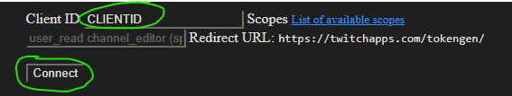

# **TwitchDiscordNotifications**


  
[](https://ko-fi.com/S6S8HV2DY)

Get notifications of your favorite streamers on your discord Dm's

## **Important links**
  
Twitch Clientid (Application): https://dev.twitch.tv/console/apps   
**(OAuth redirect link must be "https://twitchapps.com/tokengen/")**  
Twitch OAuth key: https://twitchapps.com/tokengen/  
  
Discord bot: https://discord.com/developers/applications/

## **Usage**  
### **Commands**
#### **Must be sent to bot Dm's**  
**Help** - Shows list of commands  
**Watch streamername or streamerlink** - Will get the user id and create a new list if it doesn't exist otherwise it will add the streamer to that users list  
**Unwatch streamername or streamerlink** - Removes the streamer from that user's list  
**Clear** - Deletes all the messages sent by the bot (1per second to avoid being rate limited)

## Changes
```diff

v1.2 04/07/2023

+   Fixed streamers added after bot initialization not getting checked
+   Made console interface better, showing checking when checking streamer and showing currently streaming streamers
+   Cleaner console
+   Fixed if a streamer was removed from everybodys watchlist, it wouldn't leave the currently streaming list


v1.1 03/07/2023

+   Added option to use watch with streamername or streamer link
+   Made the notification embeds prettier
+   Added clear command to delete all notifications sent by the bot

v1.0 02/07/2023

+   Created discord bot handling
+   Fixed duplication of notifications
+   Added help|watch|unwatch commands

```